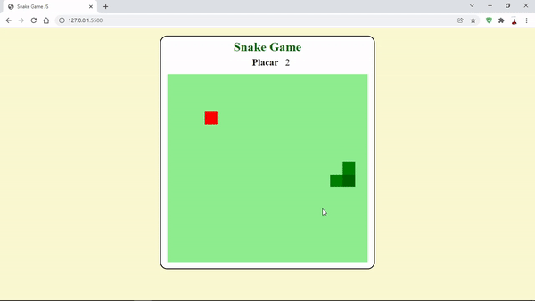

# Desafio Snake Game DIO 

  Feeling nostalgic for retro games? The Snake Game controls a dot, square, or object on a bordered plane. 


<h1 align="center">
    
</h1>

<br>

### 💻 The Project Snake Game
This will be an application DIO (digital innovation one) in this challenge Html, CSS and JavaScript  concepts create an application to train what I have learned so far.

## 🧪 Technologies

Application developed using the following technologies:

- [HTML5](https://www.w3schools.com/html/default.asp)
- [CSS3](https://www.w3schools.com/css/default.asp)
- [JavaScript](https://developer.mozilla.org/pt-BR/docs/Web/JavaScript)

 
## 🚀 Getting started


### Requirements

Clone the project and access the folder.

```bash
$ git clone https://github.com/felipe-gomes-vicente/Snake-game.git
$ cd Snake-game
```


## 📝 License

This project is licensed under the MIT License. See the [LICENSE](LICENSE.md) file for details.


---

<p align="center">Made with 💜 by Felipe Vicente👋</p>  

- ## My LinkedIn - [](https://www.linkedin.com/in/felipe-gomes-vicente/) 
